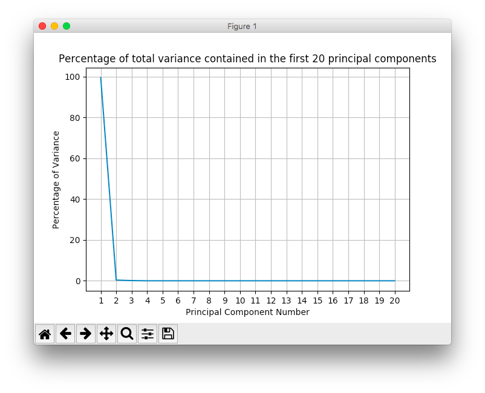

# Automobile

## Dataset

[Automobile Data Set](http://archive.ics.uci.edu/ml/datasets/Automobile)

### Data Set Information

This data set consists of three types of entities: (a) the specification of an auto in terms of various characteristics, (b) its assigned insurance risk rating, (c) its normalized losses in use as compared to other cars. The second rating corresponds to the degree to which the auto is more risky than its price indicates. Cars are initially assigned a risk factor symbol associated with its price. Then, if it is more risky (or less), this symbol is adjusted by moving it up (or down) the scale. Actuarians call this process "symboling". A value of +3 indicates that the auto is risky, -3 that it is probably pretty safe.

The third factor is the relative average loss payment per insured vehicle year. This value is normalized for all autos within a particular size classification (two-door small, station wagons, sports/speciality, etc...), and represents the average loss per car per year.

Note: Several of the attributes in the database could be used as a "class" attribute.

### Abstract

-|-
-|-
Data Set Characteristics |Multivariate
Attribute Characteristics|Categorical, Integer, Real
Number of Attributes     |26
Number of Instances      |205
Associated Tasks         |Regression
Missing Values?          |Yes

### Source

Creator/Donor:

Jeffrey C. Schlimmer (Jeffrey.Schlimmer '@' a.gp.cs.cmu.edu)

Sources:

1. 1985 Model Import Car and Truck Specifications, 1985 Ward's Automotive Yearbook.
2. Personal Auto Manuals, Insurance Services Office, 160 Water Street, New York, NY 10038
3. Insurance Collision Report, Insurance Institute for Highway Safety, Watergate 600, Washington, DC 20037

## Result

Paper - [A New Approach to Fitting Linear Models in High Dimensional Spaces](http://rexa.info/paper/1b37a079312a4d90da6e76dc5d18023c57d0d935)

First 7 Principle Component

Model                   |% Variance              |% Cumulative
------------------------|------------------------|------------
PCA Scikit Learn        |[99.54, 0.35, 0.1, 0, 0]|[99.54, 99.89, 99.99, 99.99, 99.99]

### Percentage of total variance diagram

#### PCA Scikit Learn

